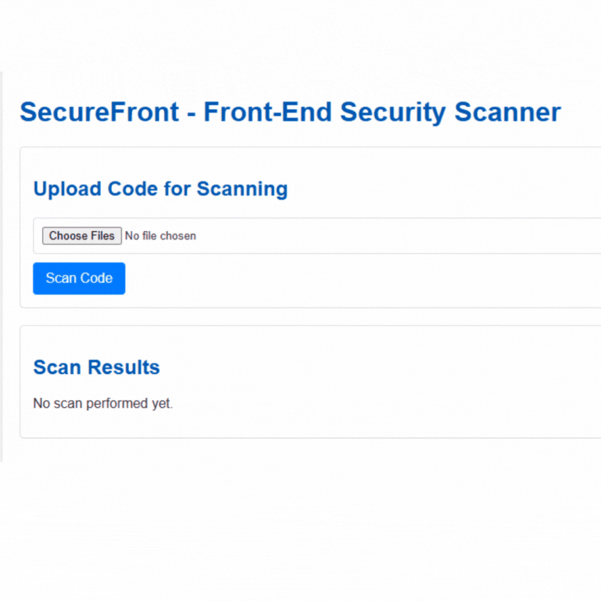

# SecureFront MVP

## 🚀 Project Overview
**SecureFront** is a local-only, browser-based static analysis tool that helps frontend developers catch common security issues — without uploading any code.

## 1. The Problem

Frontend developers — whether they’re working solo, on small teams, or at startups — often ship code quickly under pressure. Security is easy to overlook, and common vulnerabilities like hardcoded secrets, XSS, or unsafe command execution slip through.

While there are plenty of security tools out there, most are:
- Built for enterprise
- Complicated to set up
- Backend-dependent or slow
- Not well-suited to early-stage dev workflows

There’s a need for a **fast, private, zero-config tool** that flags high-risk frontend security issues before code is pushed.

##  The Solution

**SecureFront** is a local-first, browser-based static code analyzer that gives developers instant feedback on common security issues — without ever uploading code to a server.

### Key Principles:
- ⚡️ Lightweight and fast
- 🔐 Code never leaves the browser
- 🧠 Clear, helpful explanations — no security jargon

## ✨ Key Features (MVP Scope)
- **Vulnerability Scanning:** Scans code for common security vulnerabilities including:
    - Cross-Site Scripting (XSS)
    - Hardcoded Secrets (e.g., passwords, API keys, tokens)
    - Command Injection
    - SQL Injection
    - Broken Access Control
    - Security Misconfiguration
- **OWASP Top 10 Integration:** Incorporates patterns related to critical web application security risks.
- **Code Analysis:** Provides line-specific vulnerability detection with severity levels and code snippets.

## 🛠️ Tech Stack
- **Backend:** Python (with dependencies managed by `requirements.txt`)
- **Frontend/Tooling:** Node.js (with dependencies managed by `package.json`)
- **Web Framework:** Likely Flask or Django (inferred from `app/app.py` and `templates/index.html`)
- **Templating:** HTML (using `templates/index.html`)

## 📦 Getting Started
Instructions on how to set up and run the project locally.

### Prerequisites
Before you begin, ensure you have the following installed:
- **Python 3.x**
- **pip** (Python package installer, usually comes with Python)
- **Node.js** (includes npm) or **Yarn**
